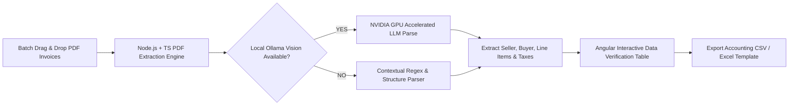

# Invoice2CSV — Automated PDF Invoice Data Extractor & Accounting Converter

> Specialized document processor that extracts structured financial line-items from PDF invoices and transforms them into standardized CSV/Excel formats customized for European & Spanish accounting software.

[](#) [](#) [](#) [](#) [](#) [](#)

---

## 1. Product Overview

**Invoice2CSV** is a focused micro-SaaS and desktop document processing utility. It automates the extraction of key financial metadata from PDF invoices (Invoice Number, Date, Supplier CIF/NIF, Client CIF/NIF, Tax Rates, Subtotal, Total, Line Items) and converts them into ready-to-import CSV/Excel formats pre-configured for accounting software (e.g. Holded, Anfix, A3Software, QuickBooks).

* **Target Audience:** Freelancers, Small Business Owners, Accountants, Bookkeepers.
* **Core Philosophy:** *PDF Invoice Batch Upload → Intelligent Data Extraction → Accounting-Ready CSV Export.*

---

## 2. Local AI & GPU Computer Vision Support (NVIDIA CUDA + Ollama)

Invoice2CSV supports hybrid extraction mode:

1. **Contextual Engine & Regex Heuristics:** Zero-cost, instant text parsing for structured PDF documents.
2. **Local Vision & LLM Acceleration (NVIDIA GPU + Ollama):** For complex scanned image-based invoices or non-standard tabular layouts, Invoice2CSV connects directly to local GPU-accelerated vision models running on **Ollama** (`http://localhost:11434`), utilizing **NVIDIA CUDA** for fast, 100% private local OCR and vision extraction without third-party API costs or cloud data privacy risks.

```text
PDF / Scanned Invoice Image
  ↓
Local NVIDIA CUDA Acceleration
  ↓
Ollama Local Vision LLM (llama3 / llava / qwen2-vl)
  ↓
Strict JSON Invoice Extraction (Seller, Buyer, Line Items, Financials)
```

---

## 3. Problem Statement

Small business owners and bookkeepers spend dozens of hours every month manually typing numbers from PDF invoices into accounting spreadsheets or ERP software. Generic OCR tools produce raw, unstructured text that still requires manual formatting.

```text
PAINFUL WORKFLOW:
50 PDF Invoices → Open each PDF → Copy/Paste Invoice Number, Date, NIF, Tax Amount → Format Excel manually → Import to Accounting Software

OPTIMIZED WORKFLOW:
Upload PDF Invoice Batch
  ↓
Invoice2CSV Extraction Engine (NVIDIA GPU Local Vision / Node.js TS)
  ↓
Export Standardized Accounting CSV (Holded / Anfix / Standard Excel)
```

---

## 4. Core Value Proposition

* **Saves 90% Manual Entry Time:** Converts 50 PDF invoices into a clean accounting CSV in under 30 seconds.
* **Pre-Configured Regional Tax Presets:** Includes specific tax rule templates for Spanish/EU invoice requirements (IVA 21%, 10%, 4%, IRPF withholdings).
* **Batch Document Processing:** Drag-and-drop hundreds of PDF files in one session.
* **100% Offline & Private GPU Processing:** Runs on local NVIDIA hardware via Ollama for total data privacy.

---

## 5. Target Users

| User | Primary Use Case | Value Delivered |
| :--- | :--- | :--- |
| **Freelancer / Gestoría Client** | Converting monthly expense invoices for tax filing | Eliminates manual typing before quarter deadlines |
| **Small Business Bookkeeper** | Preparing supplier invoices for ERP import | Saves 15+ hours per month |
| **Accounting Agency (Gestoría)** | Processing client document batches | Dramatically increases client throughput |

---

## 6. Product Workflow



---

## 7. MVP Scope

### Included in MVP
* PDF invoice parsing (Text-based PDFs and image-based scanned invoices via local Vision LLM).
* Extraction of key fields: Seller Name, Seller NIF, Buyer Name, Buyer NIF, Invoice Date, Invoice ID, Line Items breakdown, Subtotal, Tax Rate (IVA/VAT), Total.
* Pre-configured export templates (Standard CSV, Holded CSV, Anfix Excel).
* Interactive Angular validation table for reviewing and editing extracted data before downloading.
* Local GPU integration with NVIDIA CUDA + Ollama REST API (`localhost:11434`).

### Explicitly Excluded (Non-Goals)
* Full enterprise double-entry accounting software suite.
* Bank account transaction syncing or payment execution.
* Multi-year cloud document storage archive.

---

## 8. Monetization Strategy

* **Starter Pass:** **€9 / month** (Up to 100 invoices/month).
* **Pro Unlimited Pass:** **€29 / month** (Unlimited invoice parsing + priority accounting presets).
* **Desktop Lifetime License:** **€99** (Single-user offline desktop utility with local GPU support).

---

## 9. Product Evaluation Scorecard

| Criterion | Score | Justification |
| :--- | :---: | :--- |
| **Problem Pain** | 9/10 | Manual invoice data entry is universally tedious and error-prone. |
| **Problem Frequency** | 9/10 | Occurs monthly for every business and freelancer. |
| **Customer Clarity** | 9/10 | Highly specific target: Freelancers, SMEs, and Accounting Agencies. |
| **MVP Simplicity** | 7/10 | Hybrid local Vision LLM + Regex structure parser. |
| **Monetization Potential** | 9/10 | High willingness to pay to save manual bookkeeping hours. |
| **Technical Feasibility** | 9/10 | Supported natively by Ollama REST API and NVIDIA GPU drivers. |
| **Product Independence** | 10/10 | Standalone specialized document utility. |
| **Competitive Opportunity**| 9/10 | Unique offline GPU Vision feature ensures 100% data privacy. |
| **TOTAL SCORE** | **75 / 80** | **APPROVED HIGH-VALUE MICRO PRODUCT** |

---

## 10. Technology Stack & Justification

| Layer | Technology Selected | Reason for Selection |
| :--- | :--- | :--- |
| **Backend Language** | **Node.js + TypeScript** | Rich JavaScript PDF parsing libraries (`pdf-parse`, `pdf-lib`); native asynchronous file stream handling. |
| **Framework** | **Express.js** | Lightweight REST API for handling multi-part file uploads and CSV generation. |
| **Local Vision AI** | **NVIDIA CUDA + Ollama** | GPU-accelerated local Vision LLM processing (`localhost:11434`) for scanned invoices. |
| **Database** | **MongoDB** | Stores parsing templates, custom supplier layout rules, and user configuration settings. |
| **Frontend** | **Angular** | Powerful grid table components and reactive forms for reviewing and editing parsed invoice data before export. |

---

## 11. Proposed Future Repository Structure

```text
invoice2csv/
├── backend/
│   ├── src/
│   │   ├── controllers/
│   │   ├── services/
│   │   │   ├── pdf-parser.service.ts
│   │   │   ├── tax-calculator.service.ts
│   │   │   └── csv-exporter.service.ts
│   │   ├── models/
│   │   └── index.ts
├── frontend/
│   ├── src/app/
│   │   ├── components/
│   │   │   ├── upload-zone/
│   │   │   ├── verification-grid/
│   │   │   └── export-settings/
├── architecture/
│   ├── ARCHITECTURE.md
│   ├── TECH-STACK.md
│   ├── DATA-MODEL.md
│   └── API-DESIGN.md
├── agents/
│   ├── architect.md
│   ├── backend.md
│   ├── frontend.md
│   ├── database.md
│   └── qa.md
└── README.md
```

---

## 12. AI Agent Team Roles

* [architect.md](file:///home/ahmet/Desktop/Projects/micro-products/invoice2csv/agents/architect.md): Defines parsing pipelines, regex field extraction schemas, local Ollama Vision integration rules, and export adapter interfaces.
* [backend.md](file:///home/ahmet/Desktop/Projects/micro-products/invoice2csv/backend.md): Implements TypeScript PDF parsing routines, Ollama REST API integration, and CSV format generators.
* [frontend.md](file:///home/ahmet/Desktop/Projects/micro-products/invoice2csv/frontend.md): Builds the Angular drag-and-drop UI and dynamic data validation table.
* [database.md](file:///home/ahmet/Desktop/Projects/micro-products/invoice2csv/database.md): Designs MongoDB collections for custom vendor parsing templates.
* [qa.md](file:///home/ahmet/Desktop/Projects/micro-products/invoice2csv/qa.md): Validates extraction accuracy across diverse PDF invoice layouts.
